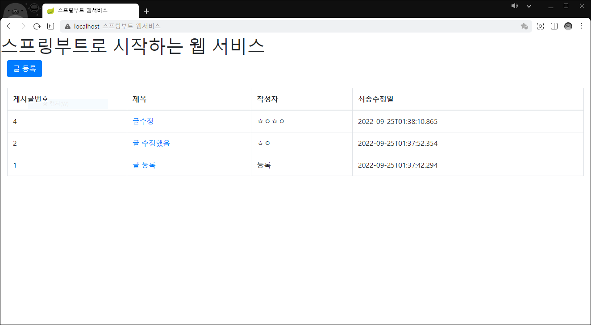

# 4장 머스테치로 화면 구성하기

- 템플릿 엔진
  - 지정된 템플릿 양식과 데이터가 합쳐져 HTML 문서를 출력하는 SW
  - 서버 템플릿 엔진(JSP, Freemarker)
    - 서버에서 Java 코드로 문자열을 만들고 이 문자열을 HTML로 변환하여 브라우저로 전달
  - 클라이언트 템플릿 엔진(React, Vue, Angular)
    - 브라우저에서 javascript 코드가 실행됨
    - 서버 사이드 렌더링 지원하는 경우도 있음(V8엔진 라이브러리들이 지원함)
  - 머스테치
    - 수많은 언어를 지원하는 가장 심플한 템플릿 엔진
    - 장점
      - 심플한 문법
      - view와 서버의 역할이 명확하게 구분됨
      - 하나의 문법으로 클라이언트/서버 템플릿 모두 사용 가능

- 기본 페이지 만들기
  - `build.gradle`에 의존성 등록
  - `src/main/resources/templates/index.mustache`에 기본적인 HTML코드를 작성함
  - IndexController
    - 문자열 반환 시, mustache starter를 통해서 앞의 경로와 뒤의 파일 확장자는 자동으로 지정됨
    - 테스트코드를 작성하여 "/"로 호출했을 때 index.mustache에 포함된 코드들이 있는지 확인해보면 된다
  - main() 실행 후 브라우저에서 8080 포트로 접속해보면 화면이 노출되는 것을 확인할 수 있다

- 게시글 등록 화면 만들기
  - 외부 CDN을 사용하여 FE 라이브러리를 사용해보자
    - `templates/layout` 디렉토리에 footer, header mustache 파일을 생성하여 공통 코드를 추가함
    - css는 header, js는 footer에 위치시켜 페이지 로딩 속도를 높인다
  - 글 등록 버튼 추가
    - 버튼 클릭 시 이동할 페이지 주소: `/posts/save`
    - `{{>layout/header}}`: `{{>}}`는 현재 mustache파일을 기준으로 다른 파일을 가져옴
  - 등록 버튼에 기능 추가하기
    - `resource/static/js/app` 디렉토리에 index.js 파일 생성
    - `index`라는 객체를 만들어 해당 객체에 필요한 모든 function을 선언하여 다른 JS와 겹치지 않도록 선언함

- 전체 조회 화면 만들기
  - mustache 문법
    - `{{#posts}}`: Java의 for문처럼 posts List를 순회함
    - `{{변수명}}`: List에서 뽑아낸 객체 필드
  - Repository
    - `@Query` 메소드를 사용하여 내림차순으로 posts를 가져오는 쿼리를 작성함
    - 가독성이 좋아 Querydsl을 사용함
  - Service
    - `@Transactional` 어노테이션에 `readOnly=true` 옵션을 추가하여 트랙잭션 범위는 유지하고 조회 기능만 남겨두어 조회 속도를 개선함
    - C,U,D 기능이 없는 서비스 메소드에서 사용
    - 람다식 코드 작성 (`.map(PostsListResponseDto::new)`)
  - Controller
    - `PostsListResponseDto` DTO 생성
    - `postsService.findAllDesc()`로 가져온 결과가 posts에 담겨 index.mustache에 전달됨

- 수정 / 삭제 화면 만들기
  - 수정
    - `readonly`: 읽기 기능만 허용하여 수정이 불가능하게 함
    - `.`으로 객체의 필드에 접근할 수 있음
    - `index.js`에 update 함수 추가
      - 전체 목록에서 수정 페이지로 이동할 수 있도록 페이지 이동 기능 추가
  - 삭제
    - JPARepository의 delete 메소드를 사용함
    - deleteById 메소드를 이용하여 id로 삭제할 수도 있으며 엔티티를 파라미터로 삭제할 수도 있음
    - 엔티티로 조회하여 존재 여부 확인 후 삭제하는 방식으로 구현

- 글 목록 조회 / 등록 / 수정 /삭제 기능 구현 완료
- 