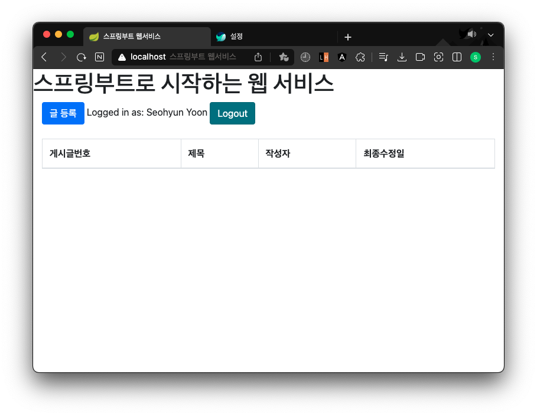
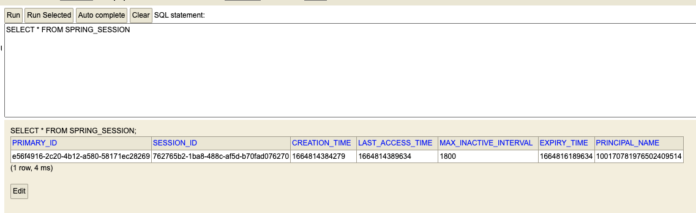

# 5장 스프링 시큐리티와 OAuth 2.0으로 로그인 기능 구현하기

- 스프링 시큐리티와 스프링 시큐리티 OAuth 2.0 클라이언트
  - OAuth 구현 시 로그인 구현에 필요한 내용을 구글, 페이스북 등에 맡기면 되고 서비스 개발에만 집중할 수 있음
  - 스프링 부트 1.5 vs 스프링 부트 2.0
    - 1.5 버전은 유지보수만 진행하며 신규 기능은 추가되지않는다고 선언함
    - 기존 방식은 확장 포인트가 적절하게 오픈되어 있지 않아 직접 상속하거나 오버라이딩 해야함
    - 2.0 버전인지 확인하는 방법: `spring-security-oauth2-autoconfigure` 라이브러리 사용 여부 + `application.properties`나 `application.yml` 정보 확인
    - 2.0 버전에서는 client 인증 정보만 입력하면 됨

- 구글 서비스 등록
  - `cloud.google.com`에 구글 로그인 후 프로젝트 생성 -> OAuth 클라이언트 ID 발급
  - 승인된 리다이렉션 URL
    - 서비스에서 파라미터로 인증 정보를 주었을 때 인증 성공 시 구글에서 리다이렉트할 URL
    - 아직 개발 단계이므로 로컬 주소만 등록함
  - application-oauth 등록
    - `application-oauth.properties` 파일을 생성하여 방금 생성한 클라이언트 ID/보안코드를 입력
    - application-xxx.properties 로 이름을 만들면 xxx라는 이름의 profile이 생성되어 관리할 수 있음
    - application.properties에 application-oauth.properties를 포함하도록 구성함
  - .gitignore 등록
    - gitignore에 `application-oauth.properties`를 등록하여 보안 주의

- 구글 로그인 연동하기
  - 사용자 정보를 담당할 도메인인 User 클래스 생성
  - `Enumertaed(EnumType.STRING)`
    - JPA로 DB에 저장 시 Enum값을 어떤 형태로 저장할지 결정함
    - 기본적으로는 `int`로 된 숫자가 저장됨, 그래서 문자열로 저장될 수 있도록 선언함
  - 사용자 권한을 관리할 Enum 클래스 Role 생성
    - 스프링 시큐리티에는 `ROLE_`이 앞에 항상 있어야함
  - User의 CRUD를 책임질 UserRepository 생성
    - email을 통해 이미 생성된 사용자인지 처음 가입하는 사용자인지 판단할 수 있도록 함

- 스프링 시큐리티 설정
  - 스프링 시큐리티 의존성 추가
  - config.auth 패키지를 만들고 시큐리티 관련 클래스를 담는다
    - SecurityConfig 클래스
      - `EnableWebSecurity`: SpringSecurity 설정 활성화시켜줌
      - `authorizeRequests`: URL별 권한 관리를 설정하는 옵션의 시작점
      - `antMatchers`: 권한 관리 대상을 지정하는 옵션 / URL, HTTP 메소드별로 관리 가능
        - `/api/v1/**`: 주소를 가진 API는 USER 권한을 가진 사람만 가능
      - `anyRequest`: `authenticated()`를 추가하여 나머지 URL들은 모두 인증된 사용자만 허용하도록 함
      - `logout().logoutSuccessUrl("/")`
        - 로그아웃 기능에 대한 여러 설정의 진입점
        - 로그아웃 성공 시 주소로 이동함
      - `userService`
        - 소셜 로그인 성공 시 후속 조치를 진행할 UserService
        - 리소스 서버로부터 받아온 사용자 정보로 추가 진행하고자하는 기능을 구현
    - CustomOAuth2UserService 클래스
      - 구글 로그인 이후 가져온 사용자 정보를 기반으로 가입 / 정보 수정 / 세션 저장 등의 기능 구현
      - `userNameAttributeName`
        - OAuth2 로그인 진행 시 키가 되는 필드값(like PK)
      - `OAuthAttributes`: OAuth2User의 attribute를 담을 클래스
      - `SessionUser`: 세션에 사용자 정보를 저장하기 위한 DTO 클래스
    - OAuthAttributes
      - `of()`: OAuth2User에서 반환하는 정보(Map)의 값을 하나씩 변환해줌
      - `toEntity()`
        - User 엔티티 생성
        - 처음 가입 시 OAuthAttributes에서 엔티티 생성
        - 가입 시 권한은 GUEST로 주기 위해서 role 빌더값에는 `Role.GEUST`를 사용함
        - OAuthAttributes 클래스 생성 후 SessionUser 클래스를 생성함
    - SessionUser
      - 인증된 사용자 정보만 필요함
      - 직렬화 기능을 가진 세션 DTO를 추가로 만드는 것이 중요한 이유
        - 엔티티 클래스는 언제 다른 엔티티 클래스와 관계가 형성될 지 모름
        - 자식 엔티티 전부 직렬 화 대상에 포함될 경우 성능 이슈, 부수 효과 발생할 확률 높음

- 로그인 테스트
  - 실행시킨 후 구글 로그인을 진행해본다.
  - 글을 작성하려고 시도하면 403 에러가 발생하는 것을 확인한다.
  - 
  - h2-console로 접속하여 권한을 USER로 변경한다.

- 어노테이션 기반으로 개선하기
  - @LoginUser
    - 메소드 인자로 세션값을 받을 수 있도록 수정해보자
  - LoginUserArgumentResolver
    - 조건에 맞는 메소드가 있다면 구현체가 지정한 값으로 해당 메소드의 파라미터로 넘겨줌
  - WebConfig
    - 스프링에서 LoginUserArgumentResolver가 인식될 수 있도록 함
  - IndexController
    - 세션 정보값을 @LoginUser 어노테이션을 통해서 가져옴

- 세션 저장소로 DB 사용하기
  - 세션 저장소의 세가지 방법
    1. 톰캣 세션 사용
       - 2대 이상의 WAS가 구동될 경우 톰캣들간의 세션 공유를 위한 추가 설정 필요
    2. MySQL과 같은 DB 사용
       - 로그인 요청마다 IO 발생하여 성능 이슈 있음
    3. Redis, Memcached같은 메모리 DB
       - B2C 서비스에서 많이 사용함
       - 외부 메모리 서버 필요
  - spring-sesison-jdbc 등록
    - h2-console에 접속해보면 테이블 2개가 생성된 것을 확인할 수 있는데 이는 JPA로 인해 자동 생성된 세션 테이블
    - 로그인을 하게되면 SPRING_SESSION에 한 개의 세션이 등록된 것을 확인할 수 있음
    - 