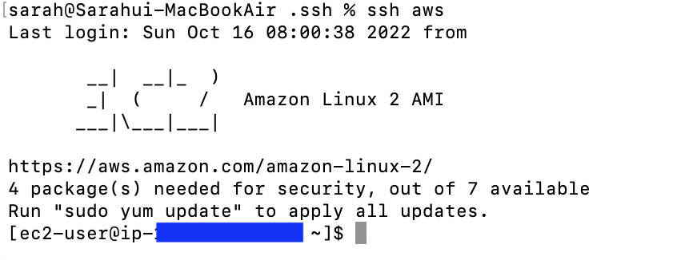

# 6장 AWS 서버 환경을 만들어 보자 - EC2

- 클라우드의 장점
  - 특정 시간에만 트래픽이 몰린다면 유동적으로 사양을 늘릴 수 있으므로 유리함

- EC2
  - 서울 리전
  - t2.micro
  - 기본 VPC 생성 후 할당
  - 키페어 생성

- EIP 할당
  - EIP 생성 후 방금 생성했던 EC2 인스턴스에 주소 연결
  - EC2 인스턴스 탭으로 다시 가보면 EIP가 할당된 것을 확인할 수 있음

- 인스턴스 접속
  - .cer 파일을 .ssh 디렉토리에 설정
  - config에 HostName을 탄력적 IP주소로 설정
  - 권한 부여
  - 접속해보기

- Amazon Linux 1 서버 설정들
  - Java 8 설치
  ```
    [ec2-user@ip-xxx-xx-xx-xx ~]$ java -version
    openjdk version "1.8.0_342"
    OpenJDK Runtime Environment (build 1.8.0_342-b07)
    OpenJDK 64-Bit Server VM (build 25.342-b07, mixed mode)
  ```
  - 타임존 변경
    - UTC+9 (한국 시간)으로 설정
  - 호스트네임 변경
    - 어떤 서비스인지 표시하기위해 hostname 정보를 바꿔준다
- 
