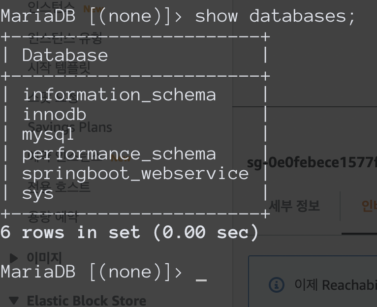

# 6,7장 복습

- 지난 시간 복습
  - EC2
    - Amazon Linux 2 AMI
    - key pair 설정
    - 네트워크 설정
      - 내 IP SSH 설정 추가
      - 80포트만 허용
    - 서버 용량: 30GB (프리티어 최대치)
    - EIP 할당
  - EC2 접속
    - JAVA 11 설치
    - `sudo yum install java-11-amazon-corretto`
    - 타임존 변경
    - `sudo rm /etc/localtime`
    - `sudo ln -s /user/share/zoneinfo/Asia/Seoul /etc/localtime`
    - Hostname 변경
    - 참고: https://docs.aws.amazon.com/ko_kr/AWSEC2/latest/UserGuide/set-hostname.html
    - `sudo vi /etc/cloud/cloud.cfg` 후 `preserve_hostname: true` 설정을 추가함
    - `sudo hostnamectl set-hostname 원하는이름`
    - `sudo reboot` 후 확인
    - `sudo vim /etc/hosts`에 변경한 hostname을 추가함
    - `127.0.0.1 원하는이름
    - `curl 원하는이름` 실행 시 80포트로 접근할 수 없다는 에러가 뜬다면 잘 작성한 것
  - RDS
    - MariaDB
    - DB 인스턴스 식별자 / 사용자 / 비밀번호 설정
    - 프리티어 / t2.micro
    - 할당 스토리지: 20
    - 퍼블릭 엑세스: yes
    - 파라미터 그룹 설정: timezone, character set(이모지 저장 여부 등), max connection(150) 설정
    - RDS VPC 보안그룹의 인바운드 규칙 편집
      - 내 IP, ec2 보안그룹에 3306 포트 규칙 추가
    - RDS 엔드포인트 주소로 DB 접속해보기
      - 만약 계속 connection timeout 발생 시, VPC > 라우팅 테이블 > 라우팅 편집 > 인터넷 게이트 웨이 추가
      - RDS가 사용하는 서브넷이 Private이었기때문에 발생하는 문제
    - 쿼리 수행
      - `show variables like 'c%';`: collation_database 값은 MariaDB에서 직접 수정 필요
      - ```
        ALTER DATABASE springboot_webservice
        CHARACTER SET = 'utf8mb4'
        COLLATE = 'utf8mb4_general_ci';
        ```
      - `select @@time_zone, now();`: timezone Asia/Seoul인거 확인
    - 새로운 테이블을 생성하고 한글이 들어가는지 확인
      - ```
        CREATE TABLE test  (
        id bigint(20) NOT NULL AUTO_INCREMENT,
        content varchar(255) DEFAULT NULL,
        PRIMARY KEY (id)
        ) ENGINE=InnoDB;

        insert into test(content) values ('테스트');

        select * from test;
        ```
    - EC2에서 RDB 접속하기
      - `sudo yum install mysql`
      - `mysql -u admin -p -h mysql엔드포인트`
      - 