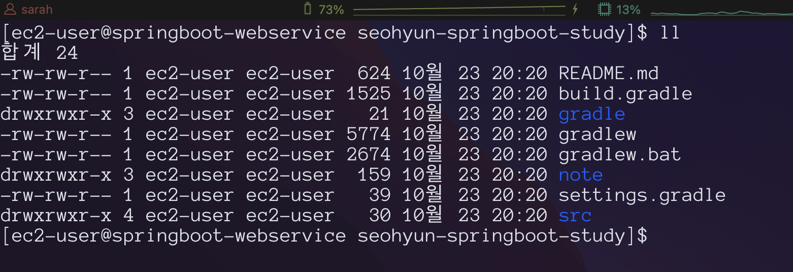
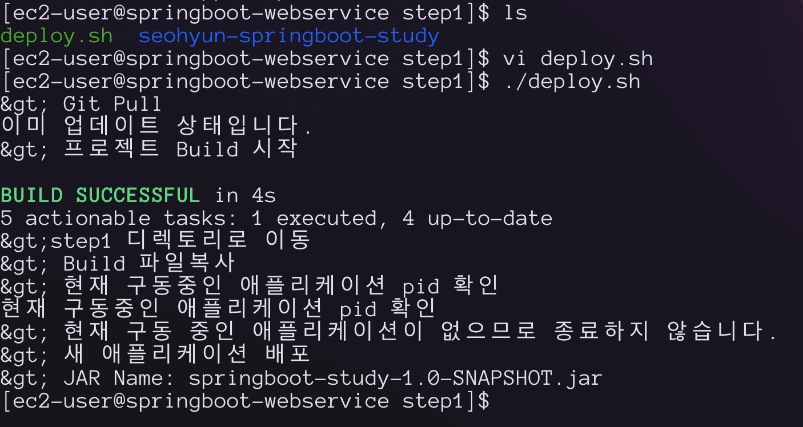
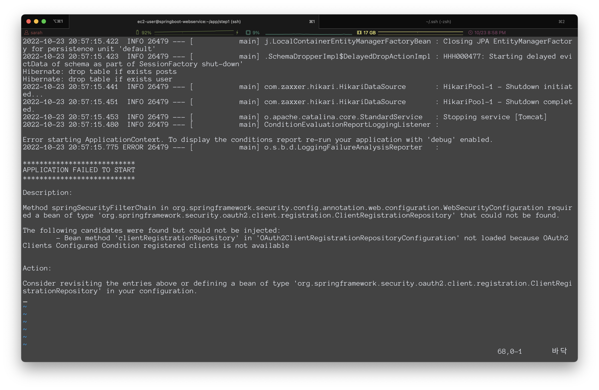
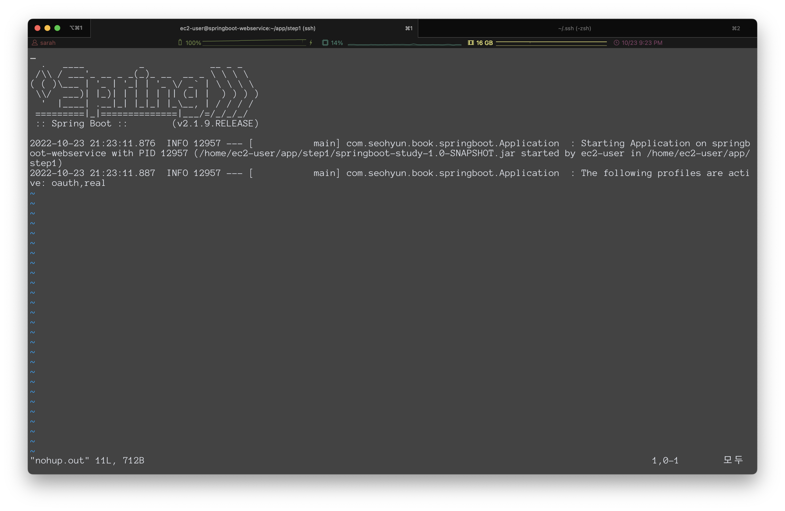
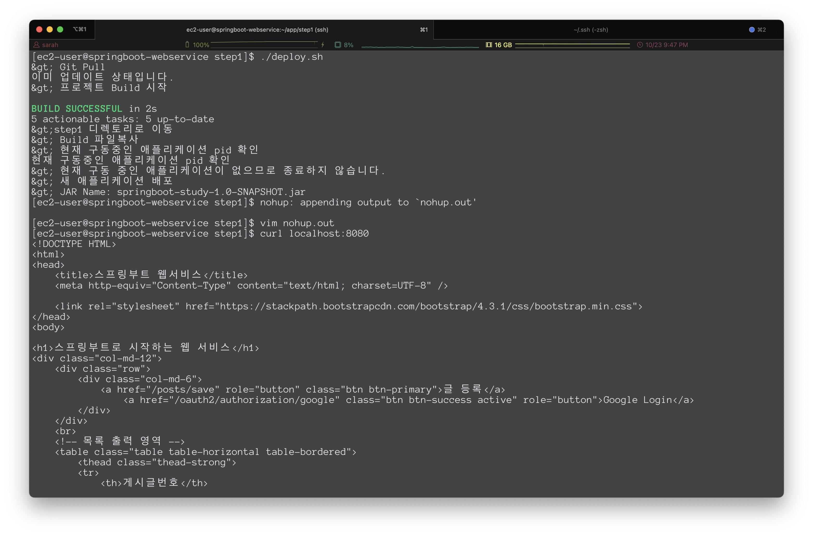

# 8장 EC2 서버에 프로젝트를 배포해 보자

- EC2에 프로젝트 clone 받기
  - `sudo yum install git`: git 설치
  - `mkdir ~/app && mkdir ~/app/step1`: 디렉토리 생성
  - 
  - 테스트가 정상 동작하는지 확인
    - `chmod +x ./gradlew`
    - `./gradlew test`
    - ```
      BUILD SUCCESSFUL in 2m 19s
      4 actionable tasks: 4 executed
      ```
    - 이슈) gradle 버전이 맞지 않아서 실패했고 gradle 버전을 4로 변경한 후에 재실행하니 테스트에 통과했다.
    - 다른 방법이 있는지는 좀 더 확인해봐야할 것 같음
    - `gradlew wrapper --gradle-version 4.10.2`

- 배포 스크립트 만들기
  - `deploy.sh` 생성 후 배포 스크립트 작성
  - [deploy.sh](../scripts/deploy.sh) 확인
  - 
  - 애플리케이션 실행 로그는 `nohup.out`에서 확인할 수 있다.
  - `nohup.out`을 열어보면, 실패 로그를 확인할 수 있다.
  - 
  - ClientRegistrationRepository를 찾을 수 없다는 에러이다.

- 외부 security 파일 등록하기
  - ec2 내부에서 클론한 프로젝트에는 `application.oauth.properties` 가 없기 때문에 발생
  - git에 업로드할 수는 없으니 서버가 직접 설정을 갖고 있도록 해보자
  - `app` 디렉토리에 `properties` 파일을 생성하고 로컬 내용을 복붙
  - `deploy.sh` 내용을 변경하여 방금 생성한 properties 파일을 사용하도록 수정
  - 

- 스프링부트 프로젝트로 RDS 접근하기
  - 테이블 생성
    - 2개의 테이블을 생성한다.
      1. JPA가 사용될 엔티티 테이블
      2. 스프링 세션이 사용될 테이블
      ```
      create table posts (
      id bigint not null auto_increment
      , created_date datetime
      , modified_date datetime
      , author varchar(255)
      , content TEXT not null
      , title varchar(500) not null
      , primary key (id)) engine=InnoDB;
      
      create table user (
      id bigint not null auto_increment
      , created_date datetime
      , modified_date datetime
      , email varchar(255) not null
      , name varchar(255) not null
      , picture varchar(255)
      , role varchar(255) not null
      , primary key (id)) engine=InnoDB;
      ```
    - 스프링 세션 테이블은 `schema-mysql.ssql`파일에서 확인할 수 있음 > 복붙 후 쿼리 실행

  - 프로젝트 설정
    - MariaDB 드라이버를 build.gradle에 등록함
    - `implementation('org.mariadb.jdbc:mariadb-java-client')`
    - `application-real.properties` 파일을 생성하고, RDS 환경 profile 설정을 추가함
  - EC2 설정
    - `app` 디렉토리에 `application-real-db.properties` 파일을 생성함
    - mariadb 주소, username, 비밀번호 설정을 추가한다.
    - `deploy.sh` 파일을 수정하여 real profile을 사용할 수 있도록 수정함
    - `./deploy.sh`를 통해 다시 실행해보자
    - `curl localhost:8080` 실행 시 html코드가 정상적으로 보이면 성공
    - 
    - 이슈) 만약 실행했는데, `The Tomcat connector configured to listen on port 8080 failed to start.` Tomcat 에러 발생 시, 8080 port에서 실행 중인 프로세스 kill 후 다시 빌드하면 된다.

